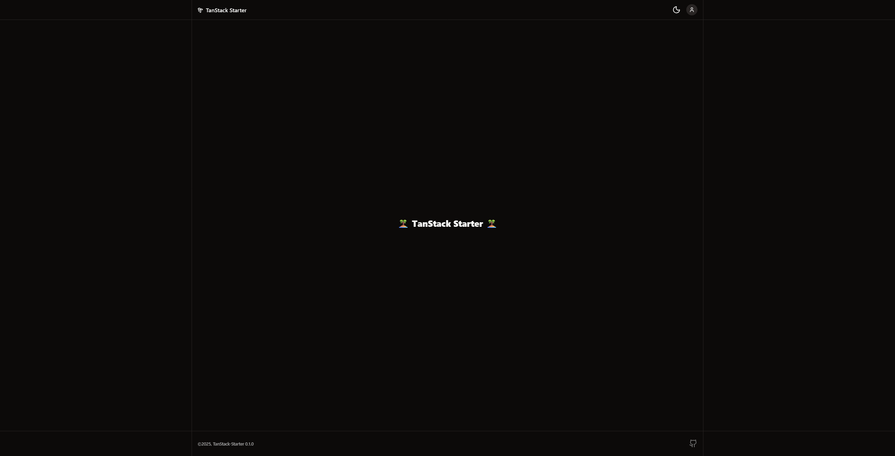
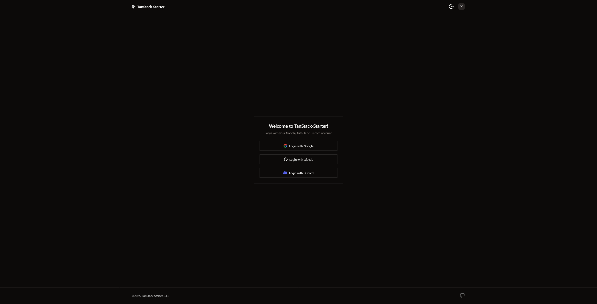

# 🏝️ TanStack-Starter

## Overview

Full-stack starter template for [TanStack Start](https://tanstack.com/start/latest) applications, batteries included. Inspired by [`dotnize/react-tanstarter`](https://github.com/dotnize/react-tanstarter).

## Development

To quickly get started, see the [`quick start`](./docs/development/quick-start.md) guide.

For specific development commands, refer to one of the following:

- [Developing with `npm`](./docs/commands/npm.md)
- [Developing with `pnpm`](./docs/commands/pnpm.md)
- [Developing with `bun`](./docs/commands/bun.md)
- [Developing with `docker`](./docs/commands/docker.md)

## Screenshots

**Home Page**

**Login Page**

## Contributors

 - [`@jackytea`](https://github.com/jackytea)

## References

- [`tanstack/router`](https://github.com/TanStack/router)
- [`dotnize/react-tanstarter`](https://github.com/dotnize/react-tanstarter)
