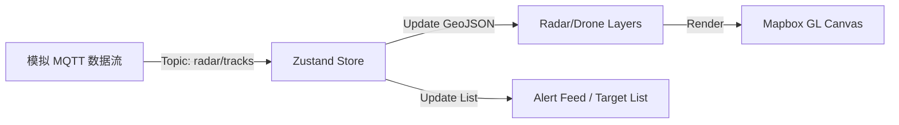

# 低空态势感知与雷达监测系统技术规范

## 1. 业务术语与定义 (Domain Terminology)

在低空经济与反无人机（C-UAS）领域，"雷达图 Visualization" 指的是基于地理空间（Geospatial）的实时态势感知地图（Situational Awareness Map），而非统计学中的蛛网图（Radar Chart）。

核心要素包括：
*   **Track（航迹/目标）**: 探测到的飞行物，包括无人机、鸟类、通用航空器等。
*   **PPI (Plan Position Indicator)**: 平面位置显示，即雷达扫描的覆盖范围和回波点。
*   **Zones（防区/围栏）**:
    *   **Detection Zone**: 探测预警区（雷达覆盖范围）。
    *   **Alarm Zone / No-Fly Zone**: 报警区/禁飞区（并在地图上以红色高亮）。
    *   **Whitelist / Friendlies**: 白名单区域或友方目标（在大疆 Aeroscope 或类似系统中标注为蓝色/绿色）。
*   **Telemetry（遥测数据）**: 目标的高度 (Altitude)、速度 (Speed)、航向 (Heading)、经纬度、SN 码 (Remote ID)。

## 2. 视觉设计风格 (Visual Design Guidelines)

参考 **Robin Radar**, **DroneDeploy**, **Dedrone**, **Anduril** 等行业顶尖案例。

### 2.1 配色方案 (Color Palette) - Dark Mode 优先 / Sci-Fi HUD
*   **总体风格**: **Sci-Fi HUD (Heads-Up Display)**，强调高对比度、线条感和数据可视化。
*   **背景 (Base Map)**: 深蓝灰色调 (Dark Slate / Midnight Blue)，减少视觉疲劳，高亮目标。
    *   推荐 Mapbox Style: `mapbox://styles/mapbox/dark-v11` 或自定义去色卫星图。
*   **目标 (Targets)**:
    *   **Unknown/Hostile (未知/敌对)**: 亮红色 (`#FF4D4D`) 或 橙色 (`#FF9F43`)。
    *   **Friendly (友方)**: 青色 (`#00E2FF`) 或 绿色 (`#2ECC71`)。
    *   **Selected (选中)**: 白色高亮光圈 + 动态引导线。
*   **雷达覆盖 (Radar Coverage)**:
    *   半透明渐变填充 (`rgba(0, 255, 128, 0.15)`)。
    *   动态扫描线 (Scanning Sweep): 模拟雷达波束旋转，增加“实时感”。

### 2.2 符号系统 (Symbology)
*   **Icon**: 使用简化的矢量图标区分类型（四旋翼、固定翼、直升机、鸟类）。
*   **Heading Indicator**: 带有锥形或箭头指示飞行方向。
*   **Trail (尾迹)**: 目标后方保留 30s ~ 60s 的轨迹线，显示飞行路径历史。

## 3. 布局与界面设计 (Layout & UI Design)

基于 C-UAS 行业标准与参考图片，界面采用 **Overlay Dashboard** 布局。地图全屏作为底层背景，功能面板悬浮于四周。

### 3.1 布局网格 (Grid Plan)
*   **Header (Top Bar)**:
    *   **Center**: "XX AIRPORT SYSTEM" 标题与系统状态概览。
    *   **Tabs**: 视图切换 (OVERVIEW / SYSTEM MANAGER / HISTORY)。
    *   **Style**: 带有斜切角或装饰线条的 Tech 风格。
*   **Left Sidebar (Stats Panel)**:
    *   **Flight Info**: 实时航班列表 (Flight number, status)。
    *   **Environment**: 鸟情活动统计、天气状况。
    *   **Charts**: 历史数据对比折线图。
*   **Right Sidebar (Alerts & Monitoring)**:
    *   **Live Camera**: 联动 PTZ 摄像头的实时画面窗口。
    *   **Alert Feed**: 滚动的告警列表 (Timestamp, Threat Level, Event)。
    *   **Target Profile**: 点击目标时显示详细参数的浮动面板。
*   **Bottom Bar (Dock)**:
    *   **Tools Navigation**: 底部常驻功能栏 (Risk Zone, Device, Radar, Settings)。
    *   **Map Controls**: 2D/3D 切换, Layer Toggle。

### 3.2 交互设计 (Interaction)
*   **Hover/Click Target**:
    *   显示 **Target Profile Card** (目标详情卡片)：
        *   `ID`: DJI-M3-8821
        *   `Model`: Mavic 3
        *   `Altitude`: 120m
        *   `Speed`: 15 m/s
        *   `Source`: Radar Unit 04
    *   在地图上绘制引线 (Leader Line) 指向目标，防止重叠。
*   **Right Click**:
    *   上下文菜单：“标记为威胁”、“加入白名单”、“控制光电追踪”。

## 4. 数据协议与接口定义 (Data Protocol & Interfaces)

### 4.1 实时雷达数据 (`ObjectTrack`)
基于 MQTT 接收的 JSON 格式，定义标准数据模型。所有字段需映射到地图上的 Visual Props。

| 字段 (Field) | 类型 | 描述 | UI 映射 (UI Mapping) |
| :--- | :--- | :--- | :--- |
| **Identity & Time** |
| `track_id` | `str` | 轨迹唯一标识符 | `Target.id` (卡片标题) |
| `track_type` | `int` | 轨迹类型编码 | `Icon` 类型 (1:无人机, 2:鸟, 3:人, 4:车) |
| `track_at` | `datetime` | 记录时间 | 用于计算数据延迟 |
| **Geospatial & Kinematics** |
| `longitude`, `latitude` | `float` | 经纬度 | `LngLat` (地图坐标) |
| `altitude` | `float` | 海拔高度 | `Popup` 显示, 3D 高度 |
| `speed` | `float` | 目标速度 | `Target Profile` |
| `course_angle` | `float` | 航向角 | `Icon` 旋转角度 (`icon-rotate`) |
| `azimuth`, `elevation` | `float` | 方位角/仰角 | 辅助雷达定位分析 |
| **Radar Specific** |
| `rcs` | `float` | 雷达反射截面积 | 用于过滤噪点或判断物体大小 |
| `doppler` | `float` | 多普勒速度 | 分析物体接近/远离 |
| `range` | `float` | 探测距离 | 辅助信息 |
| **Risk & Alert** |
| `risk_level` | `int` | 风险等级 (0-N) | `Icon` 颜色 (绿->黄->红) |
| `alert_area` | `str` | 预警区域名称 | 触发告警通知 (Alert Feed) |
| `is_in_runway` | `bool` | 是否在跑道上 | 高危告警 (Critical Alert) |

### 4.2 数据更新策略
```typescript
interface RadarSourceFrame {
  tracks: ObjectTrack[];
}

// 前端处理逻辑
// 1. 订阅 MQTT Topic
// 2. 收到 RadarSourceFrame
// 3. Diff 更新 GeoJSON Source (避免全量刷新)
// 4. 对 track_id 相同的点进行平滑插值 (Interpolation)
```

## 5. 功能模块详细规划 (Feature Specs)

### 5.1 核心地图组件 (`LowAltitudeMap`)
*   **多源图层融合**:
    *   **Satellite Layer**: 卫星影像，用于确认地面参照物。
    *   **Vector Layer**: 叠加精简路网和重要地标名称。
    *   **3D Buildings**: 开启 `fill-extrusion`，用于判断低空遮挡（例如：无人机是否在建筑物背后）。
    *   **Terrain**: 加载 DEM 数字高程模型。
    *   **Radar Layer**: 使用 Shader 实现动态扫描效果。

### 5.2 技术与数据流 (Technology & Data Flow)


*   **技术栈**: React 19, Mapbox GL JS, Tailwind CSS v4, Zustand.
*   **性能优化**: 使用 GeoJSON Source 的 `setData` 更新位置。

## 6. 开发路线图 (Roadmap)

1.  **Stage 1: Foundation (当前阶段)**
    *   **Setup**: 安装依赖，配置 Mapbox Token。
    *   **Map Client**: 创建 `<MapClient />` 组件，解决 SSR 问题。
    *   **Layout**: 实现 `Header`, `Sidebar`, `BottomDock` 的基础 CSS Grid 布局框架。
2.  **Stage 2: Visualization**
    *   **Data Model**: 定义 TypeScript 接口 `ObjectTrack`。
    *   **Drone Data**: 模拟 MQTT 实时数据流，在地图上渲染动态图标。
3.  **Stage 3: Advanced UI**
    *   **Charts**: 集成 Recharts 展示左侧统计图表。
    *   **Camera Integration**: 模拟摄像头视频流窗口。
